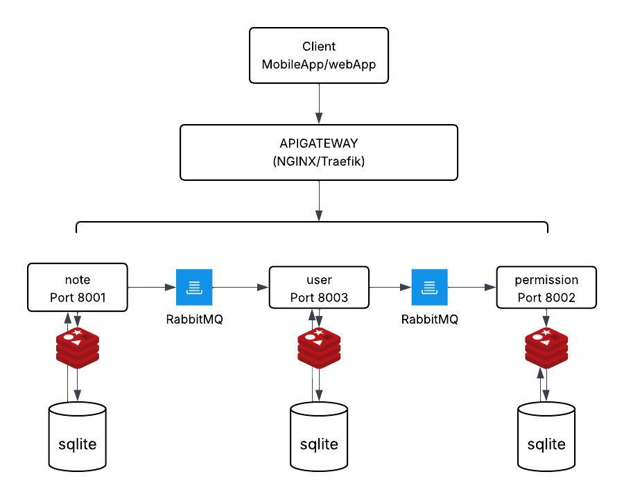

## 📝 Note Microservices with FastAPI, SQLite3, Redis & RabbitMQ


---

### 🚀 Clone the Repository
```bash
git clone https://github.com/emekadefirst/Note-Micro-Service.git appserver
cd appserver
```

---

### 🧩 System Architecture



---

### 🧰 Run the Microservices Stack

Use Docker Compose to spin up all services (API, RabbitMQ, and Redis):

```bash
docker compose -f docker/docker-compose.yml -f docker/docker-compose.mq.yml -f docker/docker-compose.redis.yml up --build
```

---

### 🧹 Shutdown & Cleanup

Stop all running containers:

```bash
docker compose down
```

Stop all containers **and remove named volumes** (to reset databases, queues, etc.):

```bash
docker compose down -v
```

Remove **all unused** images, containers, and volumes (for a full cleanup):

```bash
docker system prune -a --volumes
```

---

### 📌 TODO

* [ ] Add service discovery
* [ ] Implement centralized logging
* [ ] Add health-check endpoints
* [ ] Set up CI/CD pipeline
* [ ] Improve API documentation

---

### 💡 Optional Improvements:
1. **Add badges** for build status or Python version (GitHub-style):
   ```markdown
   
   
   
   
   
   
   ```

2. **Link to documentation** or API docs if available:

   ```markdown
   📚 [API Docs (Swagger UI)](http://localhost:8000/docs)
   ```

3. **Mention credentials** for RabbitMQ or Redis (if you set any in compose files).

---
